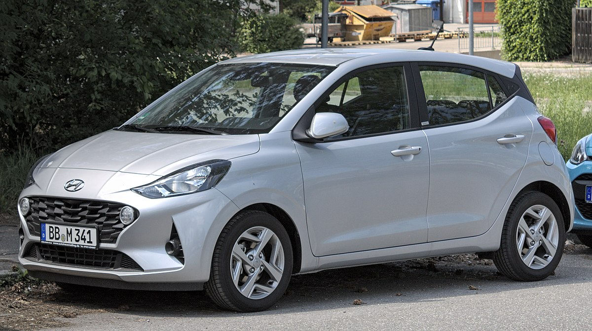
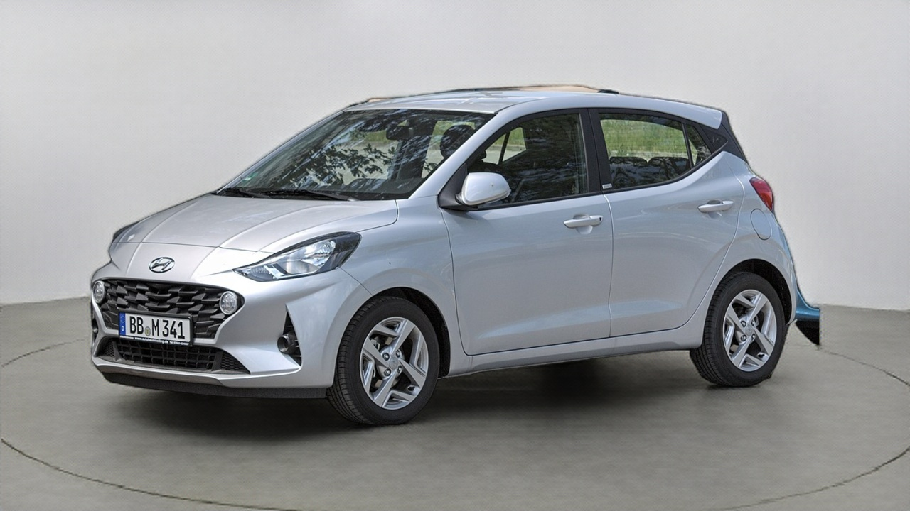
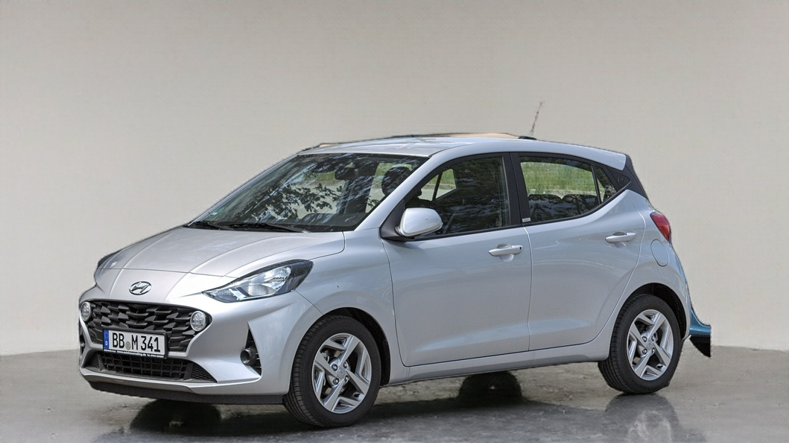
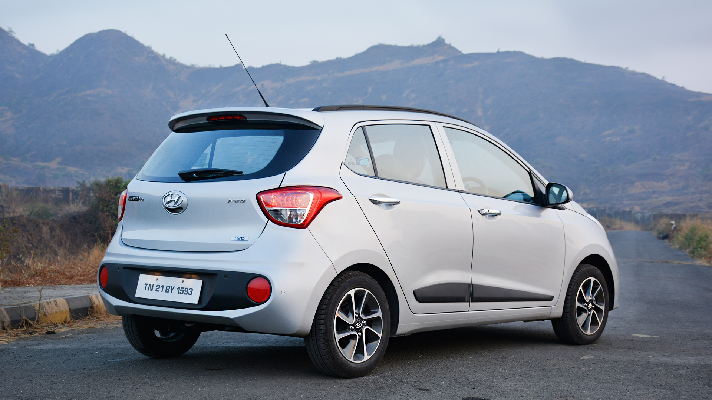
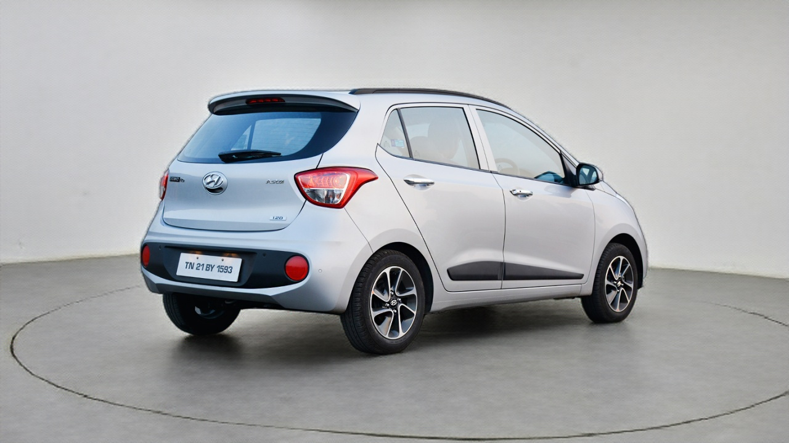
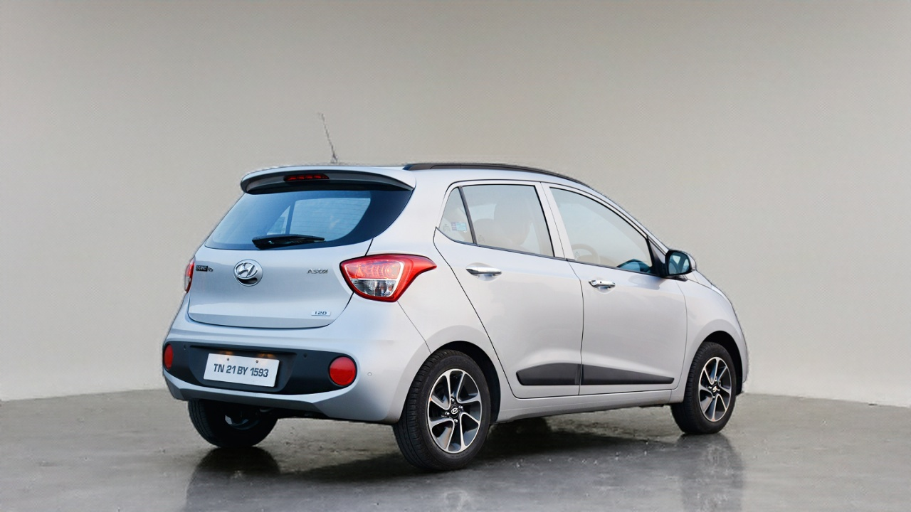

# Background and Shadow generation via AI -- bgenie-GAN

I have developed bgenie-GAN at Spyne, a Generative Adversarial Network that works like magic and is capable of placing your car from road to shining showroom in just one click. It is a novel approach and have not yet published anywhere else up till date.

# Results 

for more results refer to images folder

