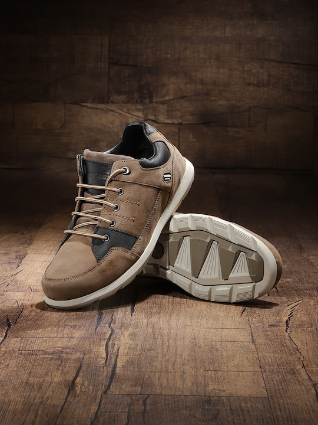
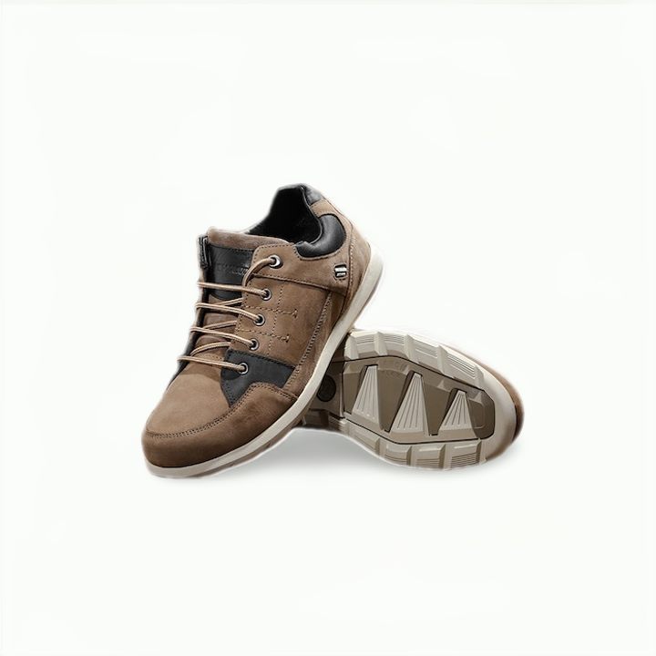
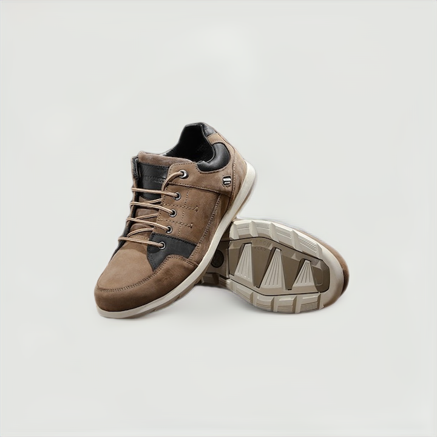
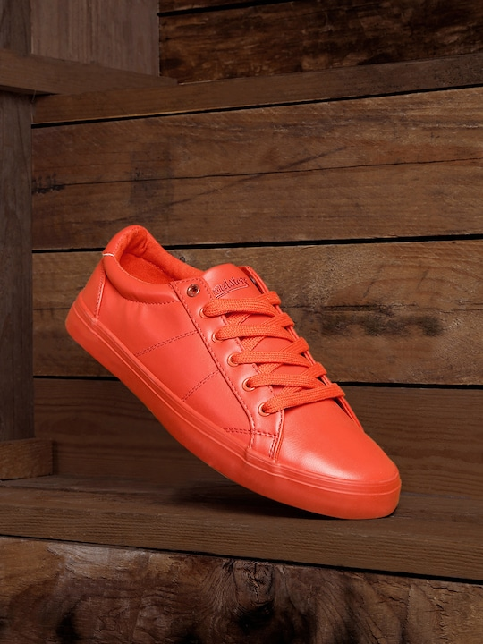
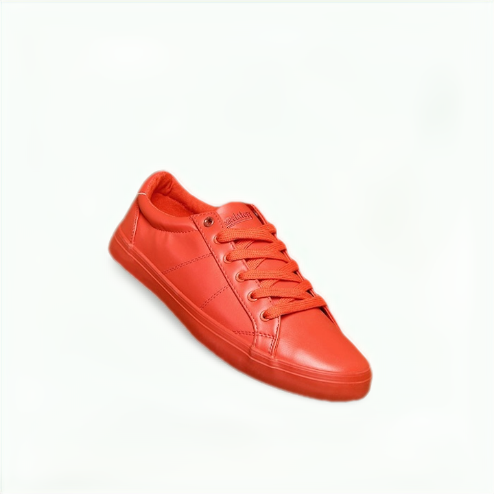
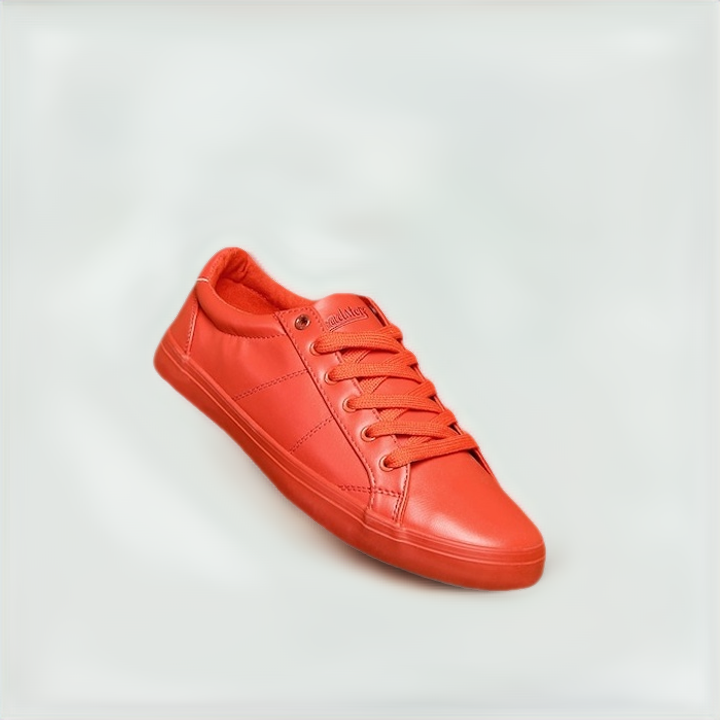

# Shadow Generation using bgenie-GAN
With some modification in loss and architecture we have also achieved shadow and background generation for footwear, my model gives you e-commerce upload ready images like you see on myntra, amazon etc.

# Results 

# Try HERE

https://www.spyne.ai/tech/footwear
